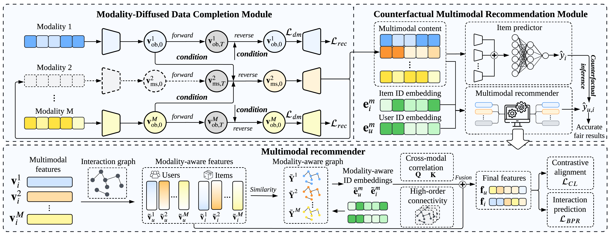

# Generating with Fairness: A Modality-Diffused Counterfactual Framework for Incomplete Multimodal Recommendations

This is the repository for WWW 2025 paper "[Generating with Fairness: A Modality-Diffused Counterfactual Framework for Incomplete Multimodal Recommendations](https://arxiv.org/pdf/2501.11916)".

<p align="center">

</p>

MoDiCF is a novel multimodal recommendation framework, featuring a modality-diffused data completion module and a counterfactual multimodal recommendation module, to address the issues of missing modality and visibility bias in incomplete multimodal scenarios.

## Requirements
- Python 3.9
- PyTorch 2.3.1
- Numpy 1.26.3
- Scipy 1.13.1
- SciKit-Learn 1.5.0

## Data
Please download the datasets from the following link:
- [https://github.com/HKUDS/MMSSL](https://github.com/HKUDS/MMSSL)

and place them in the `data` folder. 

Thanks to the [MMSSL](https://github.com/HKUDS/MMSSL) repo for sharing their datasets and codes.

We have uploaded a copy of the original datasets from [MMSSL](https://github.com/HKUDS/MMSSL) to [Google Drive](https://drive.google.com/drive/folders/1HRrXJG9MYhUrK7xMi6IOTTFJNcZkQ4_6?usp=sharing).

## Running the code
To run the code, execute the following command:
- Baby dataset
```bash
python main.py
```
- Tiktok dataset
```bash
python main.py --alpha_1 0.7 --delta 0.3 --eta 0.6 --H 4 --lambda_1 0.06 --dataset tiktok --load_dir ./checkpoint/tiktok/ --gamma 20 --alpha_2 0.3 --anchor_rate 0.5
```
- Allrecipes dataset
```bash
python main.py --alpha_1 0.6 --delta 0.4 --eta 0.3 --gnn_embed_size 128 --H 8 --lambda_1 0.15 --dataset allrecipes --load_dir ./checkpoint/allrecipes/ --gamma 20 --alpha_2 0.5 --anchor_rate 0.75
```

## Citing
If you find this work helpful to your research, please kindly consider citing our paper.

```
@inproceedings{li2025generating,
  title={Generating with Fairness: A Modality-Diffused Counterfactual Framework for Incomplete Multimodal Recommendations},
  author={Li, Jin and Wang, Shoujin and Zhang, Qi and Yu, Shui and Chen, Fang},
  booktitle={Proceedings of the ACM Web Conference},
  year={2025}
}
```